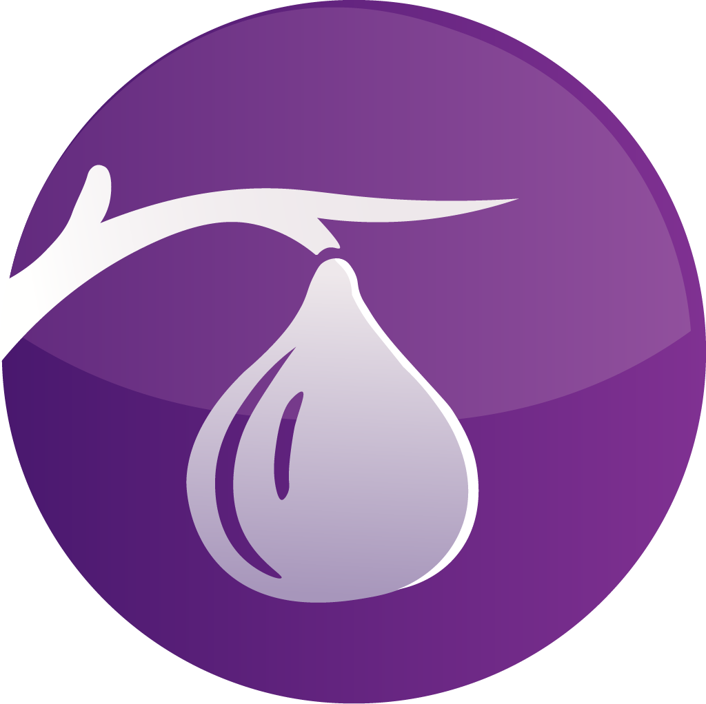

<div align="center">
  
</div>

[](https://github.com/CoreCDTL/CoreCDTL/actions)
[](LICENSE.md)
[](https://cmake.org/)
[](https://github.com/CoreCDTL/CoreCDTL/issues)
[](https://github.com/CoreCDTL/CoreCDTL/releases)


# CoreCDTL – Core C Development Toolchain Library

**CoreCDTL** is a modular runtime and plugin framework built in C and C++, with an emphasis on low-latency execution, LLVM-powered JIT compilation, and event-driven communication.

CoreCDTL serves as the stable, low-latency **runtime core**. While the core can be initialized independently, its full utility, including **cross-language bridging** (via Coregen) and **external application connectivity** (via Ficus), is delivered by its companion projects.

---

## Key Features

- **Modular Plugin System** Load and manage C-based plugins dynamically. Each plugin can expose functions, interact with the runtime, and extend system capabilities.

- **Event Bus** A publish/subscribe mechanism enabling plugins to communicate asynchronously.

- **Scheduler** High-precision scheduler supporting interval and timeout tasks.

- **HeapKit** Memory and data management utilities, allowing plugins to manipulate and share structured state.

- **Gateway Module** Embedded communication layer using Unix sockets. Provides remote control via `corecdtl-ctl`, enabling plugins like **Ficus** to connect and exchange commands.

- **Bridge API** Expose and retrieve function pointers and metadata:
  ```c
  void *plugin_bridge_get_fn_ptr(const char *plugin_name, const char *fn_name);
  char* corecdtl_api_version(void);
  char* corecdtl_abi_version(void);
  int corecdtl_init(void);

(Additional integration details are provided in the **[Coregen project](https://github.com/CoreCDTL/coregen) ↗**.)

---

## Technology Stack
<div align="center">
  <a href="https://www.cprogramming.com/">
    
  </a>
  <a href="https://isocpp.org/">
    
  </a>
  <a href="https://llvm.org/">
    
  </a>
  <a href="https://en.wikipedia.org/wiki/POSIX_Threads">
    
  </a>
  <a href="https://cmake.org/">
    
  </a>
</div>

---

## Supported Platforms
- **macOS (Darwin, arm64 / x86_64)** – primary development platform
- **Linux (x86_64, arm64)** – supported
- **Windows** – not officially supported

Compiler recommendation: **Clang/LLVM 17+**

---

## ⚡ Installation & Documentation

CoreCDTL is the foundational component of a multi-repository ecosystem. It is not designed to be run standalone.

### 🌐 Official Documentation Portal

All comprehensive guides, API references, build instructions, and contribution guidelines are hosted on the project's centralized documentation site.

* **[Installation Guide & CLI Setup](https://docs.yourproject.org/install/) ↗** — Instructions for production users, operators, and CLI tool setup.
* **[Developer Guide](https://docs.yourproject.org/developer/) ↗** — Full documentation on system dependencies (LLVM), CMake usage, debugging, and building from source.
* **[API Reference](https://docs.yourproject.org/api/) ↗** — Full documentation on all exposed core functions, versions, and metadata.

---

## 📚 Related Projects & Tooling

The CoreCDTL ecosystem is modular. Your application development process will primarily interact with these companion projects:

* **[Coregen Repository](https://github.com/CoreCDTL/coregen) ↗** – **Crucial for build integration.** Handles function pointer bridging, API/ABI translation, and manages the lifecycle of generated code. **Refer to Coregen's documentation for details on compiling and running your application.**
* **[Ficus Repository](https://github.com/CoreCDTL/ficus) ↗** – External plugin integration through the Gateway module.

---

## Contributing
Contribution guidelines are part of the centralized documentation.
For now, discussions and feedback are welcome via issues and community channels.

* **[Contribution Guidelines](https://docs.corecdtl.com/core/contributing/) ↗**

---

## License
CoreCDTL is released under a **Non-Commercial Open Source License**.
- Free to use, modify, and share for non-commercial purposes.
- Commercial usage is not permitted without explicit permission.

---

## Status
This project is in beta. Expect frequent changes and API evolution.